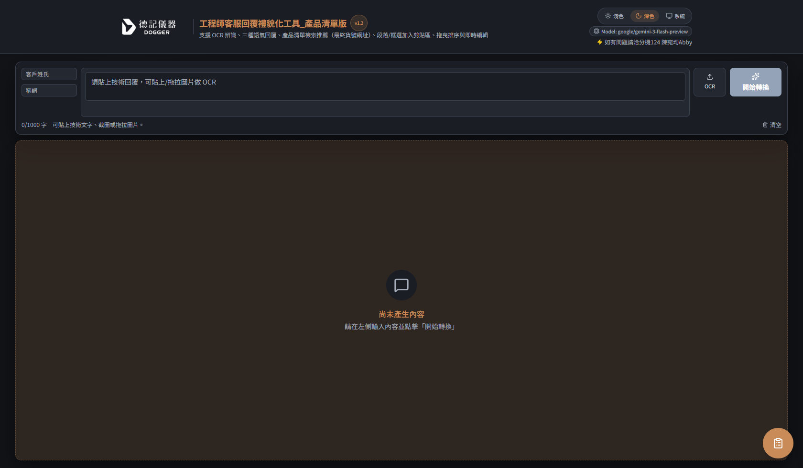
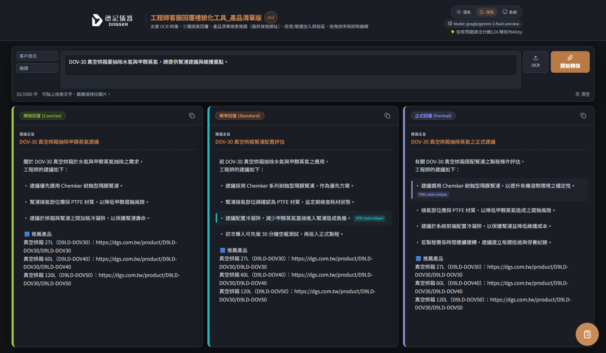
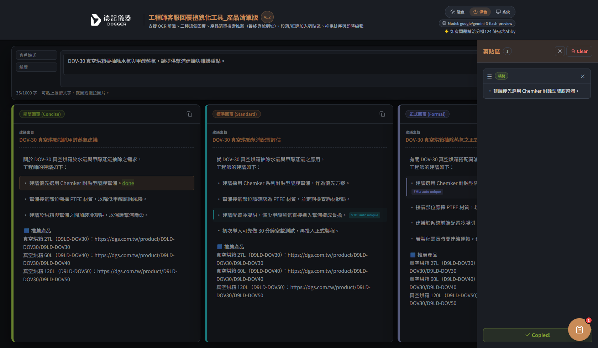

# 工程師客服回覆工具 使用說明（feature/product-list-fallback-test）

本文件以 `feature/product-list-fallback-test` 分支為基準，示範實際 UI/UX 操作流程。

## 1) 介面總覽

- 上方：輸入列（客戶姓氏、稱謂、技術內容、OCR、開始轉換）
- 中下方：三種回覆卡（精簡 / 標準 / 正式）
- 右下角：剪貼區 FAB（點擊可開啟抽屜）

## 2) 輸入內容與開始轉換

操作步驟：

1. 在輸入框貼上技術內容（可搭配 OCR）。
2. 點擊「開始轉換」。
3. 產生三種語氣回覆（順序：精簡 -> 標準 -> 正式）。

## 3) 段落/列點加入剪貼區

操作步驟：

1. 在任一回覆卡，直接點擊想保留的段落或列點。
2. 內容會加入右側「剪貼區」。
3. 抽屜會自動展開，方便立即確認與編輯。

補充：

- 目前「獨特內容標註」採**列點級**比對，重點會更精準。
- `+ Add selection` 也可把框選文字加入剪貼區。

## 4) 剪貼區編輯、排序與複製

可用功能：

1. 內容編輯：在剪貼區內可直接編輯文字。
2. 拖曳排序：使用每段左側拖曳把手調整順序。
3. 單段刪除：點每段右上角 `x`。
4. 全部清空：點 `Clear`。
5. 一鍵複製：點 `Copy All`，成功後會顯示 `Copied!`。

## 5) OCR 使用方式

- 點 `OCR` 按鈕上傳圖片。
- 也可直接把圖片貼到文字框，或拖拉圖片到輸入區。
- 辨識結果會追加到輸入內容。

## 6) 常見問題

### Q1. 為什麼有時候會出現 `Failed to fetch`？

- 通常是本機 API（`/api/polish` 或 `/api/ocr`）未啟動、網路問題，或金鑰設定異常。

### Q2. 為什麼我點一個段落卻整段都加入？

- 列點若沒有換行，模型可能會合併成同一段。
- 目前已優先做列點切分；建議輸入與提示語維持條列格式，以利精準加入。

## 7) 進一步協作（可調用 Skill）

若你要繼續優化教學頁或介面，可使用：

- `frontend-design`：製作更完整的圖文說明頁、教學 Landing Page、互動導覽。
